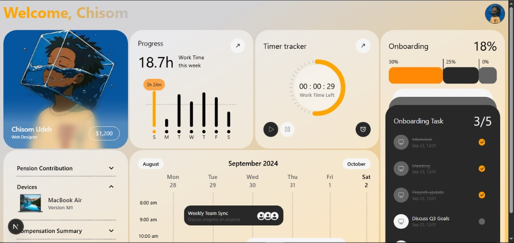

# Dashboard Page UI

A Desktop-first dashboard page built with **Next.js** and **Tailwind CSS**.
Includes a worktime timer, mini taskmanager, and much more, all in a clean modern design

## 🚀 Features  
- Desktop-first
- Clean and minimal Tailwind-based design
- Persisted timer state
- Authentication with Auth.js Oauth
- Easy to customize and extend

## 🛠️ Tech Stack  
- Next.js
- Tailwind CSS
- Typescript
- Auth.js

## 🔗 Live Demo  
[None At The Moment 😁]

## 📂 Installation  
1. Clone the repo
  ```bash
     git clone https://github.com/Udeh-png/Dashboard-With-NextJs
  ```
2. Install Dependencies
  ```bash
  npm install
  ```
3. Run the project
  ```bash
  npm run dev
  ```
4. Build the project
  ```bash
  npm run build
  npm run start
  ```

## 📸 Screenshots  
 

## ✍️ Author
- [Udeh Chisom](https://github.com/Udeh-png)
